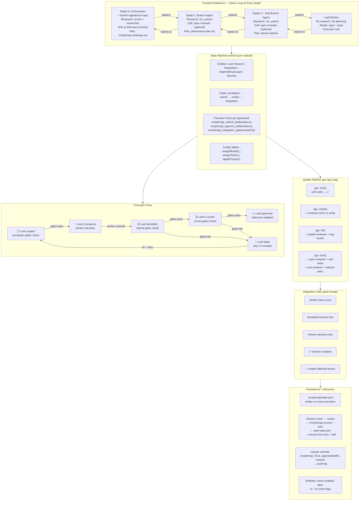

# Future MorphMap — Mech State Machine Architecture



## Key Design Decisions

| Decision | Rationale |
|----------|-----------|
| One agent (branch-agent.md) at every depth | No special orchestrator logic. Same system prompt, different scope. |
| Pure gates (mech/) + impure wiring (morphmap-hooks.ts) | Gates are testable in isolation. Hooks bind to pi lifecycle. |
| state.json as source of truth | Survives crashes. pi session memory is read-through cache. |
| Transition tools as pi-registered tools | Follows Trio pattern. TypeBox-validated. Visible to agents. |
| Backward compatible | Existing projects unchanged. mech.enabled: false = today's behavior. |
| Human override always available | morphmap_force_approve with audit log. Trust requires escape hatch. |

## File Structure

```
.morphmap/
  morphmap.mindmap.md          ← steering map (depth 0 plan)
  plans/<name>.plan.md         ← branch plans (depth 1+)
  specs/<leaf>.spec            ← contracts
  state.json                   ← runtime state (authoritative)
  config                       ← model profiles, tools, posture

  mech/                         ← PURE MODULE (zero pi imports)
    types.ts                   ← interfaces
    state.ts                   ← StateMachine<T>
    config.ts                  ← lookup tables
    gates/
      pre-spawn.ts             ← preSpawn gate chain
      submit.ts                ← submit gate chain
      review.ts                ← review gate chain
      integration.ts           ← integration gate chain
    lattice.ts                 ← compose all chains
    recovery.ts                ← error classifier, retry logic

.pi/
  agents/
    branch-agent.md            ← universal agent (every depth)
    leaf-worker.md             ← structured Plan→Build→Verify→Submit
    reviewer.md                ← mechanical + integration modes
    quality-reviewer.md        ← judgment review
    spec-reviewer.md           ← .spec atomicity review
    refactor-worker.md         ← post-code optimization
  extensions/
    morphmap-hooks.ts          ← IMPURE MODULE (pi wiring)
```

## Cost

~1750 lines TypeScript, ~9.5 hours. Pure module: ~900 lines. Impure: ~850 lines.
